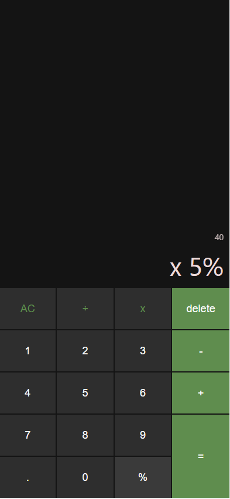

<h1>Calculator</h1>

<ul>
    
Tech stack

    <li>TypeScript</li>
    <li>HTML</li>
    <li>SCSS</li>
    <li>React</li>
</ul>

<h2>Desciption</h2>

Project which I created for learning Typescript. Calculator have that kind of operations like: <strong>Addition,</strong> <strong>Division,</strong> <strong>Multiplication,</strong> <strong>Subtraction</strong> and <strong>converting numbers to percent</strong>

# Preview

